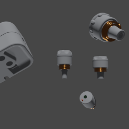
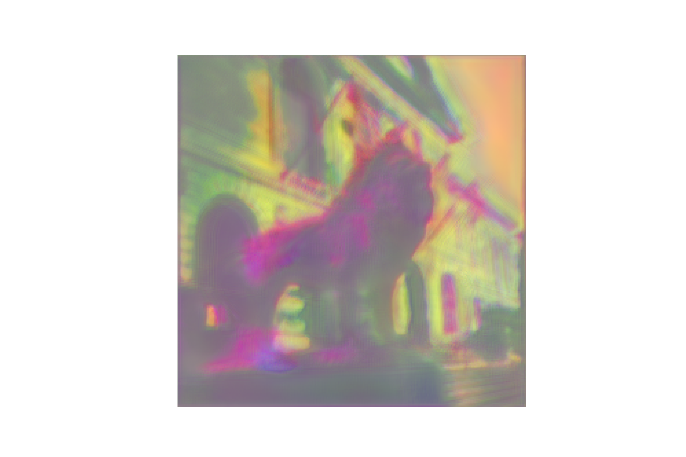
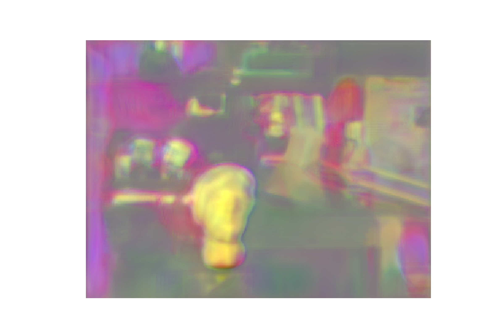

# Normals estimation based on dual camera images.

## Examples
| 0000.png                         | 0001.png                         | 0002.png                         |
| -------------------------------- | -------------------------------- | -------------------------------- |
|      |      |      |
|  |  |  |

## Results
Epoch: 39, loss=(total:0.7971 l1:0.3615599572658539 1-cos:0.4355396628379822) </br>
MSE=2.0624	RMSE=1.4332	MAE=1.3626	MME=1.5578 </br>
TANGLE11.25=0.0259	TANGLE22.5=0.0725	TANGLE30.0=0.1048

Trained on [bdataset_stereo](https://drive.google.com/drive/folders/1IlFDUHxvjXrwdo9GdHM764n9HKwnzfml) for 40 epochs using Adam.

Train Configuration
```yaml
LEARNING_RATE: 0.0001
BETAS: [.9, .999]
EPS: 0.00000001
WEIGHT_DECAY: 0.0001

MILESTONES: [10, 20, 30]
GAMMA: .2

NUM_EPOCHS: 40
```

**Google Colab** notebook: <a href="https://colab.research.google.com/github/alexjercan/normals-estimation/blob/master/tutorial.ipynb"></a>

## References
- [Du2Net: Learning Depth Estimation from Dual-Cameras and Dual-Pixels](https://arxiv.org/pdf/2003.14299.pdf) -> Dual camera input
- [StereoNet: Guided Hierarchical Refinement for Real-Time Edge-Aware Depth Prediction](https://arxiv.org/pdf/1807.08865.pdf) -> Shared weights for feature extraction in dual camera input
- [Depth Estimation via Affinity Learned with Convolutional Spatial Propagation Network](https://openaccess.thecvf.com/content_ECCV_2018/papers/Xinjing_Cheng_Depth_Estimation_via_ECCV_2018_paper.pdf) -> Uses UNet type architecture
- [GeoNet: Geometric Neural Network for Joint Depth and Surface Normal Estimation](https://xjqi.github.io/geonet.pdf) -> Consistency between depth map and normal map
